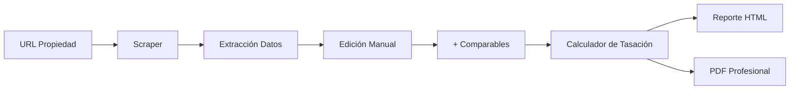

# Diego Ferreyra Inmobiliaria - Sistema de Gestión y Tasación

Sistema de gestión inmobiliaria interno con **tasación automática de propiedades** usando el método de comparables de mercado.

## 🏢 Características Principales

### 📊 Tasación Automatizada
- **Scraping automático** de ZonaProp, ArgenProp y MercadoLibre
- **Método de comparables de mercado** con ajustes por:
  - Superficie homogeneizada (cubierta, semi-cubierta, descubierta)
  - Ubicación y disposición (frente, contrafrente, lateral, interno)
  - Piso y altura
  - Calidad constructiva
  - Deprec iación por edad (método Ross-Heidecke)
- **Tabla de tasación detallada** con coeficientes de ajuste
- **Análisis de mercado** con semáforo de precios

### 📄 Generación de PDF Profesional
- **Informe de tasación de 13 páginas** con:
  - Portada institucional con logos y branding
  - Detalles completos de la propiedad con fotos
  - Datos referenciales de mercado (CABA y por barrio)
  - Propiedades competidoras con indicador semáforo
  - Tabla detallada del método de comparables
  - Estrategia de venta y pricing
  - Términos y condiciones
- Diseño profesional basado en template real
- Exportación con un solo clic

### 🏗️ Stack Tecnológico

**Frontend:**
- Next.js 15 con App Router
- React 19
- TypeScript
- TailwindCSS
- shadcn/ui

**Backend:**
- Supabase (PostgreSQL, Auth, Storage)
- API Routes de Next.js
- Gemini AI para análisis de imágenes

**PDF Generation:**
- @react-pdf/renderer

**Scraping:**
- Cheerio
- Node.js fetch

## 🚀 Instalación

```bash
# Clonar repositorio
git clone https://github.com/Sujupar97/diego-ferreyra-inmobiliaria.git
cd diego-ferreyra-inmobiliaria

# Instalar dependencias
npm install

# Configurar variables de entorno
cp .env.local.example .env.local
# Editar .env.local con tus credenciales

# Ejecutar en desarrollo
npm run dev
```

## 📋 Variables de Entorno

```env
# Supabase
NEXT_PUBLIC_SUPABASE_URL=your-project-url
NEXT_PUBLIC_SUPABASE_ANON_KEY=your-anon-key
SUPABASE_SERVICE_ROLE_KEY=your-service-role-key

# Gemini AI
GEMINI_API_KEY=your-gemini-key
```

## 📖 Uso

### 1. Nueva Tasación

1. Navega a **"Nueva Tasación"**
2. Ingresa la URL de la propiedad objetivo (ZonaProp, ArgenProp, o MercadoLibre)
3. Revisa y edita los datos extraídos (superficie, antigüedad, calidad, etc.)
4. Agrega propiedades comparables (mínimo 3 recomendado)
5. Haz clic en **"Calcular Valor de Mercado"**
6. Revisa el informe HTML con análisis detallado
7. Genera el PDF profesional con **"Generar PDF"**

### 2. Método de Comparables

El sistema implementa el método de comparables usado por tasadores profesionales:

```
Precio Ajustado = Precio Original × (Coef. Sujeto / Coef. Comparable)

Donde cada coeficiente incluye:
- Superficie Homogeneizada
- Piso
- Disposición
- Calidad Constructiva
- Depreciación por Edad (Ross-Heidecke)
```

La fórmula de depreciación Ross-Heidecke:
```
Factor Edad = 1 - (K / 2)
K = valor de tabla según % vida útil y estado de conservación
```

## 📂 Estructura del Proyecto

```
├── app/
│   ├── (dashboard)/
│   │   └── appraisal/new/        # Página de nueva tasación
│   └── api/
│       ├── scrape/                # API de scraping
│       ├── analyze-image/         # Análisis de imágenes con Gemini
│       └── pdf/                   # Generación de PDF
├── components/
│   ├── appraisal/
│   │   ├── PropertyForm.tsx       # Formulario de búsqueda
│   │   ├── PropertyManualEdit.tsx # Edición manual de datos
│   │   ├── ComparablesList.tsx    # Lista de comparables
│   │   ├── ValuationReport.tsx    # Reporte HTML
│   │   └── pdf/
│   │       ├── PDFReport.tsx      # Documento PDF completo
│   │       └── PDFStyles.ts       # Estilos del PDF
│   └── ui/                        # Componentes shadcn/ui
├── lib/
│   ├── scraper/                   # Extractores por portal
│   │   ├── zonaPropExtractor.ts
│   │   ├── argenPropExtractor.ts
│   │   └── mercadoLibreExtractor.ts
│   ├── valuation/
│   │   ├── calculator.ts          # Motor de cálculo
│   │   └── rules.ts               # Coeficientes y reglas
│   ├── supabase/                  # Cliente Supabase
│   └── ai/                        # Integración Gemini
├── public/pdf-assets/             # Assets para PDF
│   ├── logos/
│   ├── photos/
│   ├── graphics/
│   └── monthly-data/              # Gráficos de mercado
└── supabase/
    └── migrations/                # Migraciones de DB
```

## 🔄 Flujo de Datos



## 📊 Base de Datos (Supabase)

### Tablas

- **properties**: Propiedades scrapeadas
- **appraisals**: Tasaciones generadas
- **comparable_properties**: Relación muchos-a-muchos

Ver schema completo en `/supabase/migrations/20251217124253_initial_schema.sql`

## 🎨 Diseño del PDF

El PDF sigue un diseño profesional en 13 páginas:

1. **Portada** - Logos institucionales, branding Diego Ferreyra
2. **Propiedad** - Detalles, fotos, mapa de ubicación
3-4. **Mercado CABA** - Stock, escrituras, heatmaps
5. **Divisor** - "Propiedades que Compiten"
6. **Semáforo** - Educación sobre zonas de precio
7-8. **Comparables** - Fichas detalladas con indicador semáforo
9. **Tabla de Tasación** - Método de comparables con ajustes
10. **Divisor** - "Estrategia de Venta"
11. **Estrategia** - Precio, difusión, seguimiento
12. **Términos** - Autorización y honorarios
13. **Contraportada** - Contacto y redes sociales

## 📝 Licencia

Proyecto privado - Diego Ferreyra Inmobiliaria © 2025

## 👨‍💻 Desarrollo

Desarrollado usando **Gemini Deep Research** y **Antigravity AI Agent**.

---

**Nota**: Este es un sistema interno para uso exclusivo de Diego Ferreyra Inmobiliaria. Los datos de mercado se actualizan mensualmente.
